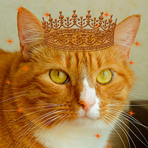

# Nikulina Irina



***
### Contacts
* **telegram**: [@imarealonecat](https://t.me/imarealonecat)
* **tel**: [+7(911)789-84-97](tel:+79117898497)
* **e-mail**: [Nikulinairina1@yandex.ru](mailto:Nikulinairina1@yandex.ru)
* **discord**: [Irina Nikulina](https://discord.com/users/916652469176664124)

***
### About me
I'm in my middle-ish thirties. Live in Saint-Petersburg, Russia. I was a school teacher once in my small hometown. Taught children russian language and literature. One day I quit my job and move to SPb. Been here and there, doing stuff, working hard. Well you know just trying my best to live this life like everyone (✿◡‿◡)
Couple years ago I was lucky to study **HTML+CSS** and I liked it so much! I made several landing pages and pare of simple sites. But my knowledges are still so far from good...And I'm ready to learn! I hope one day I will be able to call myself a full-fledged developer!

***
### My skills
* **HARD**
   + HTML , CSS , Basic JS
   + VS Code
   + Ps Adobe, Ai Adobe, Figma
###
* **SOFT**
   + fast learner
   + stress-resistant
   + know how "to google"
   + team player
   
***
###  Code example
```
function multiply(a, b){
  a * b
  return a*b
}
```
***
### Experience
My last project:

>Site for branding and digital creative agency [BeProfi](https://beprofi.info)

### Education
>* **Pedagogical Institute Saratov State University named by N.G. Chernyshevsky**
Specialist's degree
"Russian language and literature teacher"

>* **Online Courses:**
   >>* Epic skills: HTML, CSS
   >>* Code Basics: HTML, CSS, JS
   >>* HTML Academy: HTML, CSS

***

### English level
